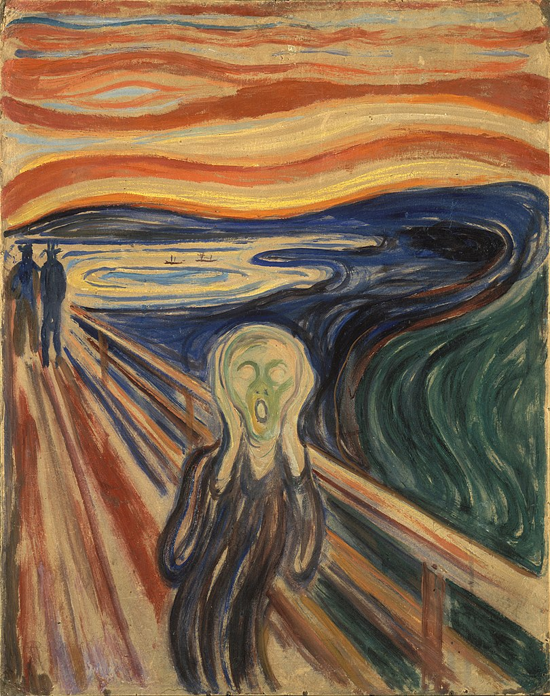

# ypan0516_quiz_8

## PART 1
### Major project artwork selection: Edvard Munch - 'The Scream'
The artwork I have chosen for my major project is 'The Scream' by Edvard Munch. 

### Innovative imaging technology selection
Through the smooth lines in the original picture and the figures on the bridge from far to near, one can imagine a dynamic sky and figures in circulation. Therefore, this creative image technology from the Van Gogh Art Exhibition more closely extends the original painting of "The Scream", which can change the static lines of different colors and areas under the guidance of the mouse or other interactive functions to generate new image elements or extensions.

## PART 2
In terms of Coding Technique Exploration, I have found two coding techniques with different functions: 
1. Adding new image effect(Fluorescent effect) with mouse movement. 
2. Changing and distorting the original image with mouse movement, to create a kaleidoscopic visual effect.

### Image 1 (with the Link to sample code)

Code Link: https://openprocessing.org/sketch/2203239

### Image 2 (with the Link to sample code)

Code Link: https://openprocessing.org/sketch/2205668